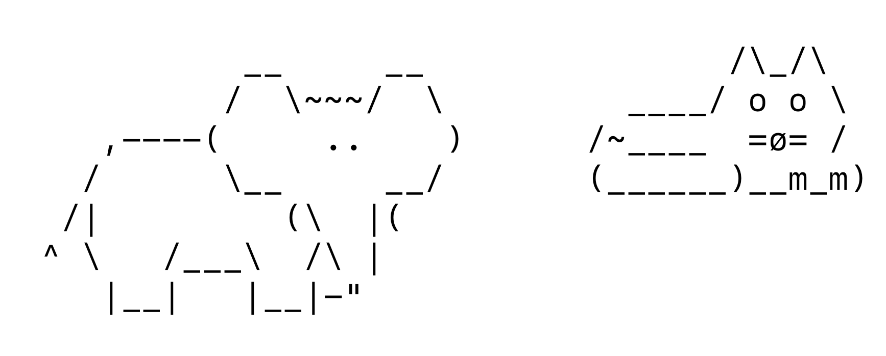

# molab-2026-itp-jackie

Class work for MoLab 2026 ITP — Jackie

## Week01

- [MyPlayground.playground](Week01/MyPlayground.playground) — Swift fundamentals
  - `Hello Playground` — starter page
  - `generative random` — random emoji pattern generator (sample code from [molab-itp/01-Playground](https://github.com/molab-itp/01-Playground))

## Week02

Homework, Option 1: a playground that creates an image using ascii text.

- [02-Ascii-Play.playground](Week02/02-Ascii-Play.playground) — strings, arrays and ASCII art (sample code from [molab-itp/02-Ascii-Play](https://github.com/molab-itp/02-Ascii-Play))
  - `ascii image` — **my homework.** Loads two ascii animals from Resources, places them side by side, draws them into a `UIImage` and saves it as a png
  - `animals ascii` — load ASCII art text files from the playground Resources bundle
  - `cows ascii` — load the cows collection from a URL
  - `cows for loops` — iterate the cows with for loops
  - `cows grouped` — split the file into an array, one cow per entry
  - `cows sorted` — sort the cows by character count
  - `cows tuple` — sort with tuples to keep track of the original order
  - `inter weave` / `inter weave func` / `inter weave 3` — interleave lines of two or three ASCII animals
