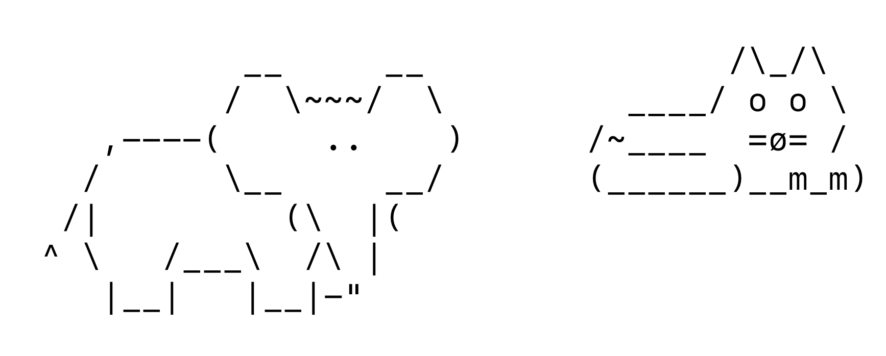
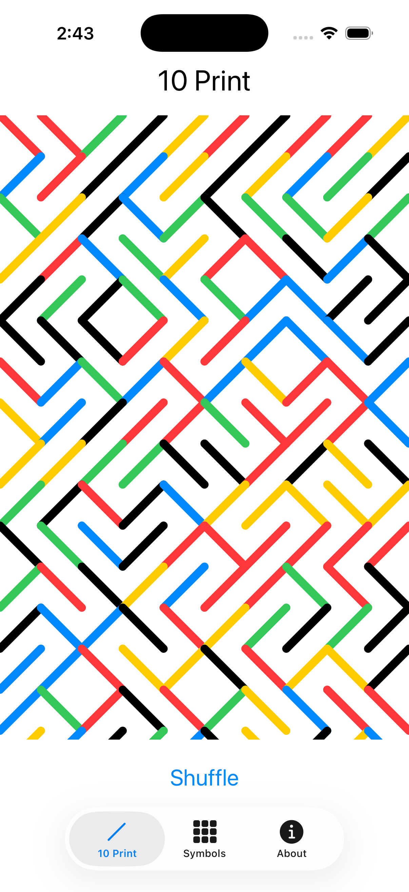
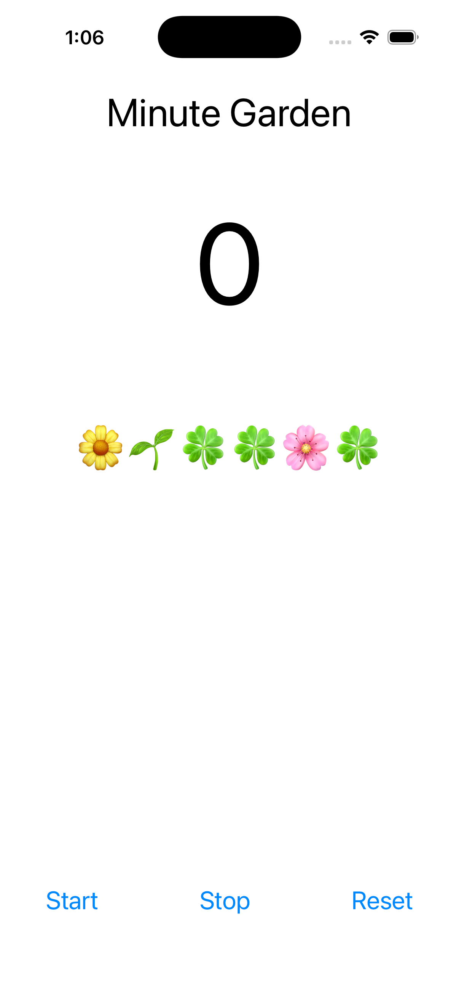
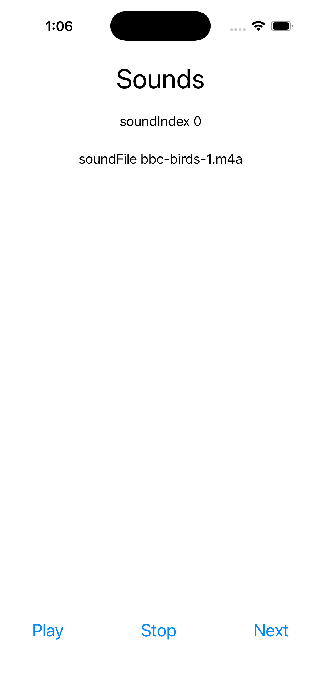

# molab-2026-itp-jackie

Class work for MoLab 2026 ITP — Jackie

## Week01

- [MyPlayground.playground](Week01/MyPlayground.playground) — Swift fundamentals
  - `Hello Playground` — starter page
  - `generative random` — random emoji pattern generator (sample code from [molab-itp/01-Playground](https://github.com/molab-itp/01-Playground))

## Week02

Homework, Option 1: a playground that creates an image using ascii text.

- [02-Ascii-Play.playground](Week02/02-Ascii-Play.playground) — strings, arrays and ASCII art (sample code from [molab-itp/02-Ascii-Play](https://github.com/molab-itp/02-Ascii-Play))
  - `ascii image` — **my homework.** Loads two ascii animals from Resources, places them side by side, draws them into a `UIImage` and saves it as a png
  - `animals ascii` — load ASCII art text files from the playground Resources bundle
  - `cows ascii` — load the cows collection from a URL
  - `cows for loops` — iterate the cows with for loops
  - `cows grouped` — split the file into an array, one cow per entry
  - `cows sorted` — sort the cows by character count
  - `cows tuple` — sort with tuples to keep track of the original order
  - `inter weave` / `inter weave func` / `inter weave 3` — interleave lines of two or three ASCII animals

## Week03

Homework: a multi view SwiftUI app that displays an image composed of random elements,
using arrays and random numbers. First week as a real Xcode app project instead of a playground.

- [TenPrintTiles](Week03/TenPrintTiles) — four tab SwiftUI app, runs in the simulator
  - `ContentView` — the `TabView` that holds the four tabs (pattern from [molab-itp/03-About-Me](https://github.com/molab-itp/03-About-Me))
  - `TenPrintView` — the 10Print algorithm drawn with `Canvas`. Builds an array of random tiles, each with a random slash direction (`Bool.random()`) and a random color (`randomElement()`). Shuffle button rebuilds the array (based on [molab-itp/03-Canvas-Explore](https://github.com/molab-itp/03-Canvas-Explore) / `CanvasAnimView`)
  - `SymbolGridView` — same idea with random SF Symbols instead of lines (`Image(systemName:)` from [molab-itp/03-ImageUiDemo-1-symbols](https://github.com/molab-itp/03-ImageUiDemo-1-symbols))
  - `EmojiGridView` — **my own take.** A copy of `SymbolGridView` filled with my most used emojis, shuffled randomly. Emoji are text rather than symbols, so this one uses `Text(...)` instead of `Image(systemName:)`
  - `AboutView` — plain text describing what the other tabs do

## Week04

Homework: a SwiftUI app that incorporates time and/or audio playback, with at least two pages.

 

- [MinuteGarden](Week04/MinuteGarden) — **my homework.** A one minute timer. Press Start
  and a plant is added every 10 seconds while birds play underneath; a chime rings at zero
  - `Audio.swift` — the sound file names, the plant emoji, and `loadBundleAudio`, copied
    from [molab-itp/04-Audio-State-Demo](https://github.com/molab-itp/04-Audio-State-Demo) / `PlayAudioView`
  - `ContentView` — the `TabView` holding the three pages (same pattern as Week03)
  - `TimerView` — `Timer.publish(every: 1)` counts down from 60 in `.onReceive`. Every
    10th second adds a random plant to a string of emoji; zero stops the birds and plays
    the chime (countdown from `CountDownTimerView`)
  - `SoundsView` — Play / Stop / Next through the three sounds, essentially
    `PlayAudioView` with the names changed
  - `AboutView` — what the app is
  - Uses `@State` only — no shared model, no structs of my own, no grid math, so I can
    explain every line
